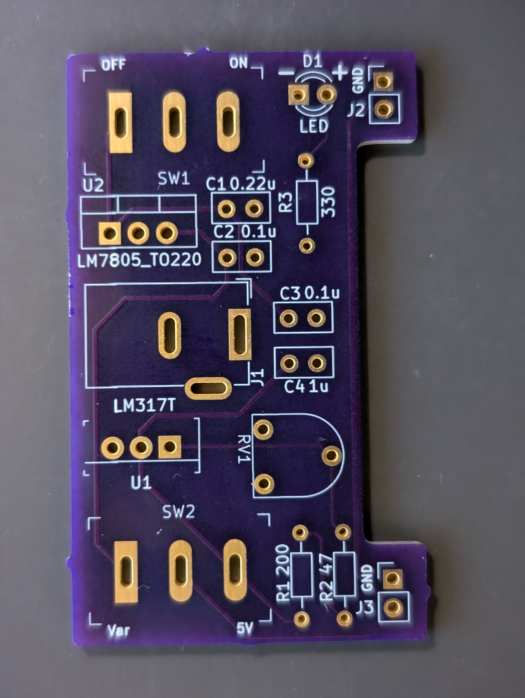
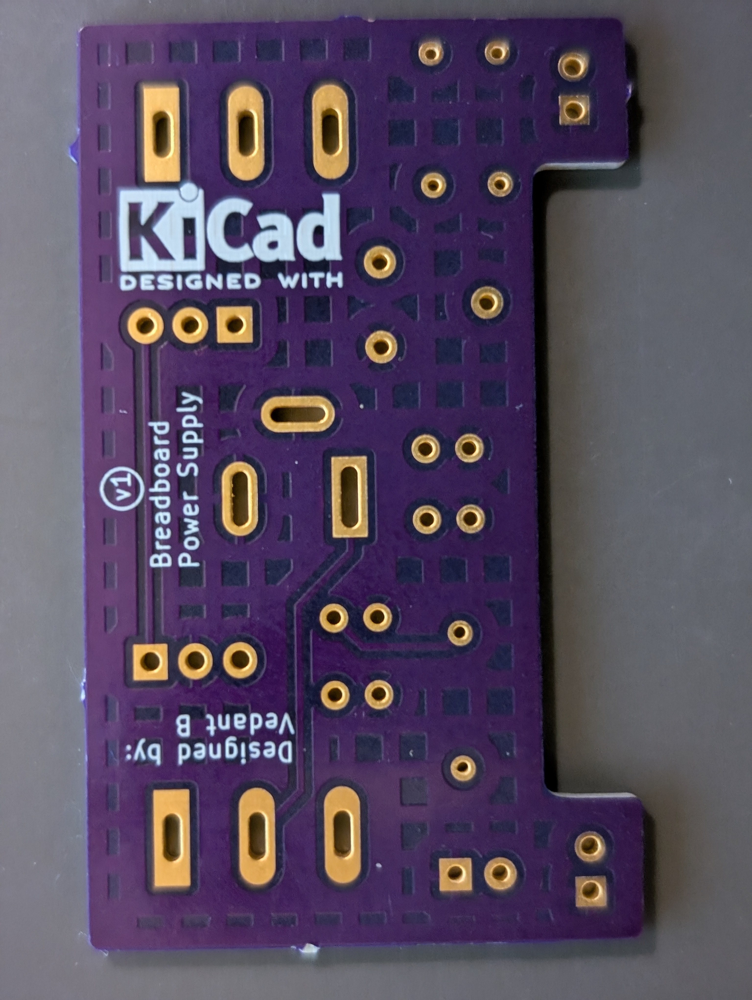
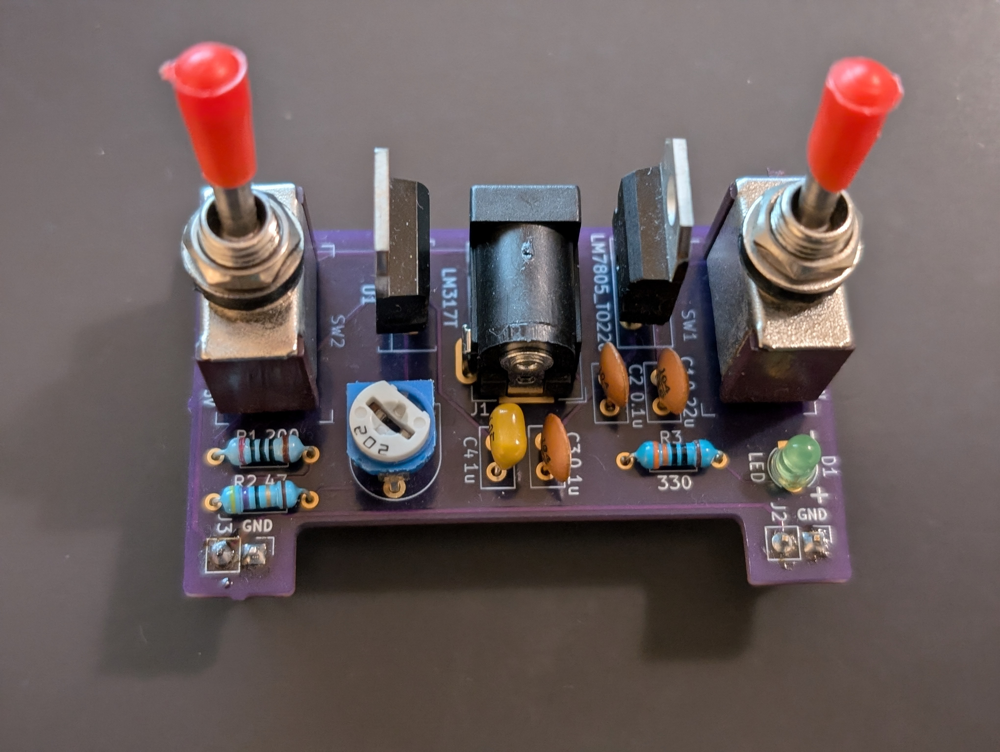
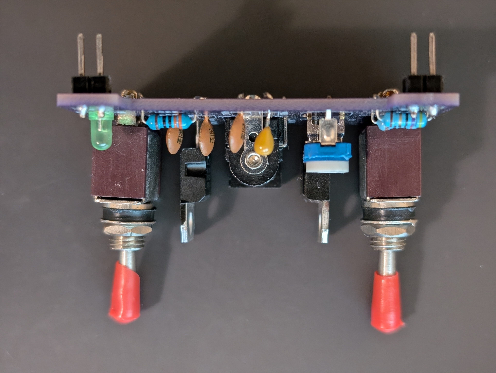

# Breadboard Power Supply
This is a custom PCB for a breadboard power supply I created to use parts already available in my parts bin. It utilizes LM317 and LM7805 voltage regulators to provide an output voltage of 5V or a variable output voltage range depending on the supply voltage. Power is supplied to the circuit via an external power supply using a barrel jack connector. There are two large switches that turn the circuit on/off and switch the output voltage between 5V or the variable voltage. An LED indicates whether the circuit is turned on/off to prevent short circuits during experimentation on the breadboard. The PCB can be connected directly to the power rails on a standard breadboard using the pin headers. 

